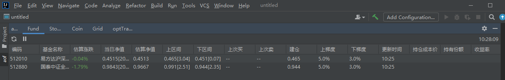
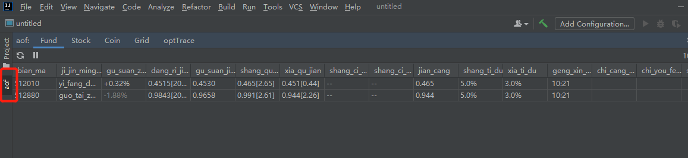
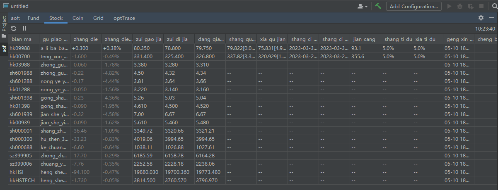
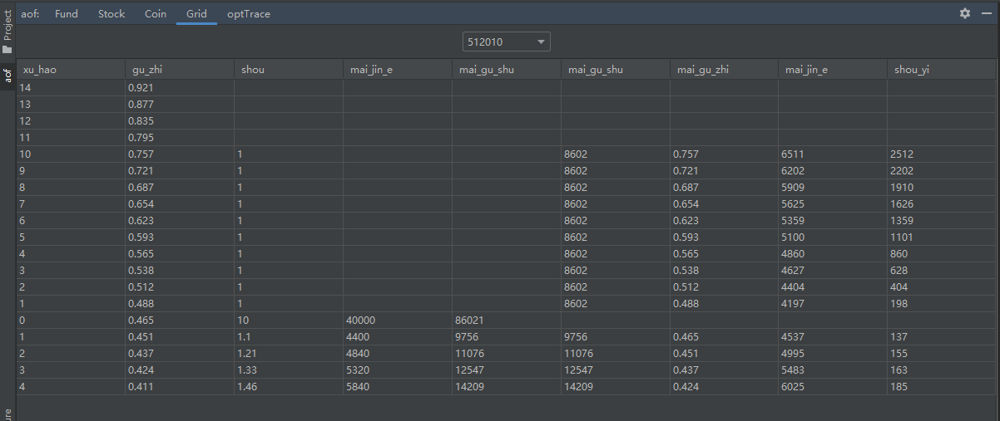
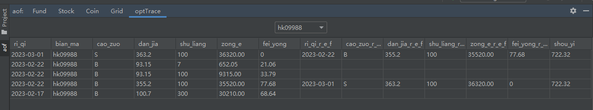
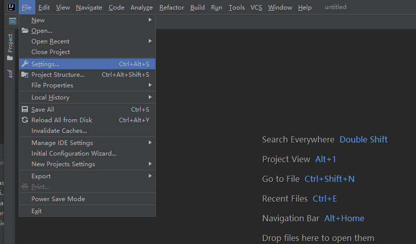
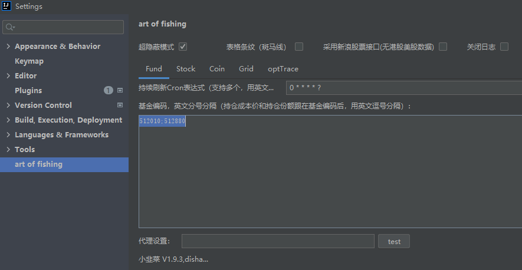

# 背景
1. 平时会做一些网格操作，工作一忙，就错过了一些操作时机
2. 偶然间看到github的这个项目[https://github.com/huage2580/leeks](https://github.com/huage2580/leeks)挺适合我的需求
3. 在这个插件基础上面做了些修改，增加网格策略，操作记录，在基金、股票指数上面增加关联。

# 项目地址
[https://github.com/lzmhehe/art_of_fishing](https://github.com/lzmhehe/art_of_fishing)
[插件下载地址](https://github.com/lzmhehe/art_of_fishing/releases)
找到 art_of_fishing-x.x.x.zip 下载后，直接在IDEA里面安装（安装方式自行百度），注意：直接选择zip文件安装，不要解压。
大家根据自己的需求，自行修改
# 使用
## 效果



打开隐蔽效果





## 设置


#### fund 设置样例
> 512010;512880


#### stock设置样例
> hk09988;hk00700;hk03988;hk03988;sh601988;sh601288;hk01288;sh601398;hk01398;sh601939;hk00939;sh000001;sh000300;sh000688;sz399905;sz399006;hkHSI;hkHSTECH

指数的数据也在这里设置

#### Grid策略设置
```json
[
  {
    "code": "512010",
    "type": "FUND",
    "gridStrategy": {
      "historyMax": 0.917,
      "historyMin": 0.417,
      "openUnitValue": 0.465,
      "openHands": 10,
      "oneHandAmt": 4000,
      "upStep": 0.05,
      "downStep": 0.03,
      "downStepHandsRadio": 0.1,
      "amtScale": 0,
      "handsScale": 2,
      "profitScale": 0,
      "unitValueScale": 3
    }
  },
  {
    "code": "512880",
    "type": "FUND",
    "gridStrategy": {
      "historyMax": 1.395,
      "historyMin": 0.613,
      "openUnitValue": 0.944,
      "openHands": 7,
      "oneHandAmt": 5000,
      "upStep": 0.05,
      "downStep": 0.03,
      "downStepHandsRadio": 0.1,
      "amtScale": 0,
      "handsScale": 2,
      "profitScale": 0,
      "unitValueScale": 3
    }
  },
  {
    "code": "hk00700",
    "type": "STOCK",
    "gridStrategy": {
      "historyMax": 704,
      "historyMin": 208,
      "openUnitValue": 355.6,
      "openHands": 10,
      "oneHandAmt": 4000,
      "upStep": 0.05,
      "downStep": 0.05,
      "downStepHandsRadio": 0.0,
      "amtScale": 0,
      "handsScale": 2,
      "profitScale": 0,
      "unitValueScale": 3
    }
  },
  {
    "code": "hk09988",
    "type": "STOCK",
    "gridStrategy": {
      "historyMax": 203,
      "historyMin": 60,
      "openUnitValue": 93.1,
      "openHands": 10,
      "oneHandAmt": 4000,
      "upStep": 0.05,
      "downStep": 0.05,
      "downStepHandsRadio": 0.0,
      "amtScale": 0,
      "handsScale": 2,
      "profitScale": 0,
      "unitValueScale": 3
    }
  }
]
```
**说明**
```java
    /**
     * 历史最高 市值
     */
    double historyMax;
    /**
     * 历史最低 市值
     */
    double historyMin;
    /**
     * 建仓 市值
     */
    double openUnitValue;
    /**
     * 建仓值向上 止盈 step；5% =0.05
     */
    float upStep;
    /**
     * 建仓值向下 补仓 step；3% =0.03
     */
    float downStep;
    /**
     * 一手多少钱（注意不是一手多少股）
     * 因为我们建策略的时候，更关心需要花多少钱，压测时，钱的极限
     */
    int oneHandAmt;
    /**
     * 建仓时 一次买入多少手
     */
    int openHands;
    /**
     * 向下建仓，可能有增加系数，1表示 保持不变，1.1 表示 每个step相对前一个增加1.1倍
     */
    float downStepHandsRadio;
    /**
     * 购买多少手，小数位
     */
    int handsScale;
    /**
     * 价格，小数位
     */
    int unitValueScale;
    /**
     * 利润小数位
     */
    int profitScale;
    /**
     * 总金额小数位
     */
    int amtScale;

```

#### 操作记录设置
> 20230222,hk09988,B,355.2,100,77.68
> 20230301,hk09988,S,363.2,100,0,20230222|355.2

**说明：

**
```java
    /**
     * 操作时间 ：day
     * pattern  yyyyMMdd yyyy-MM-dd
     */
    String date;
    /**
     * code
     */
    String code;
    /**
     * 操作类型 B|S
     */
    OperateType type;
    /**
     * 单价
     */
    String unitPrice;
    /**
     * 操作数量
     */
    String num;
    /**
     * 手续费（option）
     */
    String fee;
    /**
     * 关联交易，pattern 交易日期|单价（option）
     */
    String ref;
```
